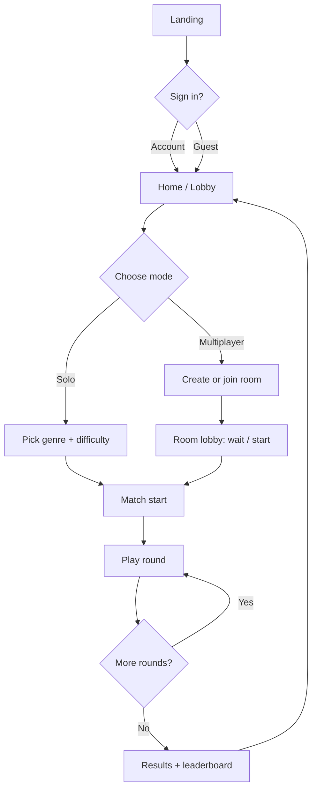
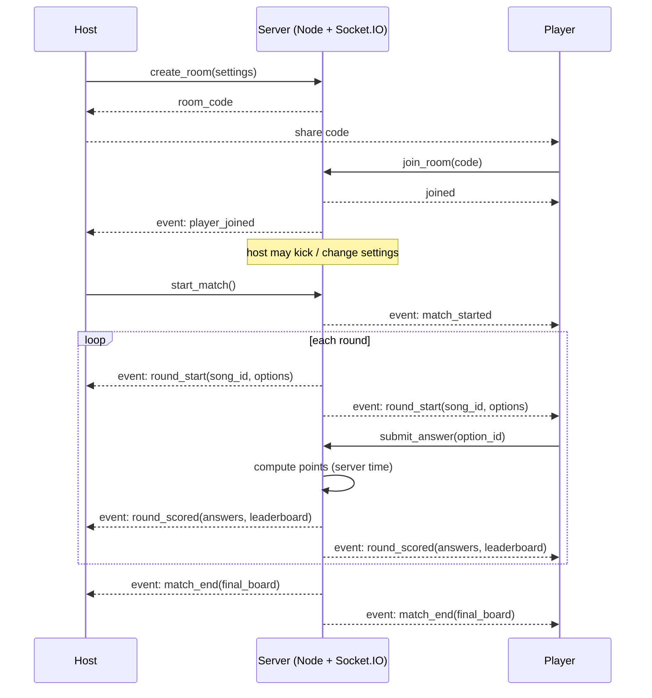
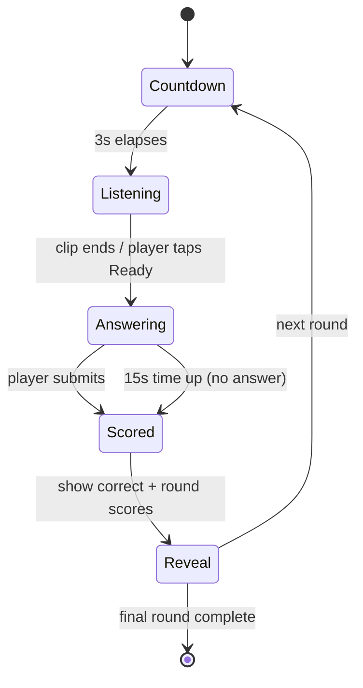
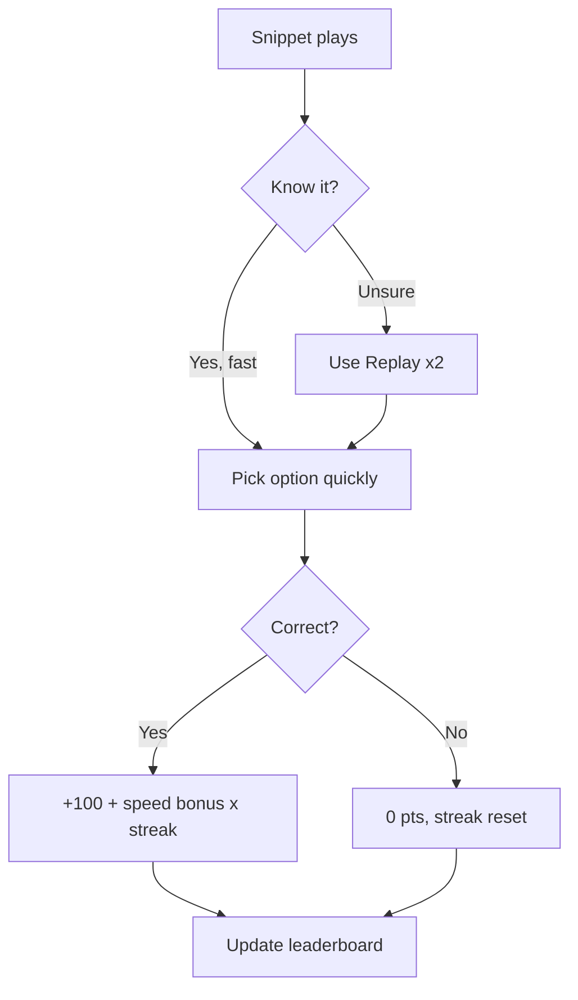

# Musika — Project Specification

> A fast-paced, competitive music-guessing trivia game.
> A short song snippet plays → players identify the **artist** and/or **song** from multiple-choice options → **faster correct answers earn more points** → the highest score when the final round ends wins.

**Status:** DRAFT v1 — for review before build.
**Target platform:** Web app (desktop + mobile browsers).

---

## 1. Overview / Vision

Musika is a real-time multiplayer music trivia game. Friends (or strangers) join a room, listen to short audio clips, and race to answer multiple-choice questions correctly and quickly. Speed and accuracy drive the score, so the leaderboard shifts after every round, keeping the tension high.

**Elevator pitch:** "Guess the song before the others do — the quicker you are, the more you score."

---

## 2. Goals

- G1. A tight, fun, repeatable core loop (listen → guess → score) under ~20s per round.
- G2. Real-time multiplayer rooms (2–8 players) with a live, shifting leaderboard.
- G3. Speed-based scoring that rewards quick, correct answers.
- G4. A browsable song library organized by genre/category and difficulty.
- G5. Solo/practice mode + global & friends leaderboards.
- G6. Polished, responsive UI that works on phones and desktops.

## Non-Goals (v1)

- No user-uploaded audio / no UGC content (moderation + licensing).
- No in-app purchases / payments in v1 (revenue can be added later).
- No team-based play in v1 (head-to-head individual only; teams can be a v2 feature).
- No offline mode.

---

## 3. Target Users

- Casual gamers, students, and friends who enjoy party/quiz nights.
- Music fans of varying knowledge levels (served via difficulty tiers).
- Play sessions of 2–6 minutes (one match = 8–10 rounds).

---

## 4. Core Gameplay

### 4.1 The loop (one round)

1. **Countdown** — brief "get ready" (3s) between rounds.
2. **Listening** — a short audio snippet (4–8s, by difficulty) plays. The player may press **Replay** a limited number of times (e.g., 2 replays), each replay costing a small speed bonus.
3. **Answering** — a question is shown with **4 multiple-choice options** and a visible countdown (default **15s**).
   - Question types (chosen per round):
     - **"Who is the artist?"** — 4 artist names.
     - **"Which song is this?"** — 4 song titles (same artist).
4. **Score + Reveal** — points are computed instantly; the correct answer is highlighted, everyone's round score and the updated leaderboard are shown.
5. Loop until the final round, then the **results screen**.

### 4.2 Answer option generation

- 1 correct option + 3 distractors.
- Distractor strategy (fair but challenging):
  - For **artist** questions: other artists from the same genre/era.
  - For **song** questions: other songs by the same artist (harder).
- Options are shuffled per player to prevent "the answer is always A."

### 4.3 Rounds per match

- Default **8 rounds**, host can choose 5 / 8 / 12.
- Each round draws a distinct song (no repeats within a match).

---

## 5. Game Modes

| Mode | Description | Players |
|------|-------------|---------|
| **Multiplayer (Live)** | Create/join a room with a 4-char code. Host starts. Shared leaderboard. | 2–8 |
| **Solo (Practice)** | Play against the clock, build a score, compare to global leaderboard. | 1 |
| **Quick 1v1 (v2)** | Direct match via invite link. | 2 |

**Room lifecycle states:** `waiting` → `countdown` → `playing` → `finished`.
- Host can kick players (pre-start), change settings, and start.
- Leaving mid-match marks the player as `dropped`; their accumulated score is kept for the final board.

---

## 6. Scoring System

Per correct answer:

```
round_points = (BASE + speed_bonus) * streak_multiplier
```

- **BASE** = 100 points for a correct answer.
- **speed_bonus** = up to 100, decays linearly over the 15s window:
  - `speed_bonus = round(100 * (1 - t / 15))`, `t` = seconds taken.
  - Answer in ~1s → ~100 bonus. At 15s → 0 bonus.
  - Each **Replay** used subtracts 15 from the bonus (floor at 0).
- **streak_multiplier** = `1 + 0.1 * (streak - 1)`, capped at **2.0**.
  - Consecutive correct answers increase the streak; a wrong/no-answer resets it to 0.
- **Wrong or no answer** = 0 points, streak resets.
- Ties broken by total fastest-answer time, then alphabetically (stable, non-random).

**Example:** Answer correct in 3s, 4th in a row → `(100 + 80) * 1.3 = 234 pts`.

> Scoring is computed **authoritatively on the backend** (Node service on your VPS) using server timestamps, so players can't cheat the timer.

---

## 7. Song Library & Data Model

### 7.1 Song entity

| Field | Type | Notes |
|-------|------|-------|
| id | uuid | PK |
| title | text | Song name |
| artist | text | Artist name |
| genre | text | e.g. Pop, Rock, Hip-Hop, K-Pop, EDM, Malay, Classic |
| year | int | Release year |
| difficulty | enum | easy / medium / hard |
| audio_path | text | Storage path of full clip |
| snippet_start_s | float | Where the 4–8s clip starts (skip intro) |
| snippet_len_s | float | Clip length by difficulty (easy 8 / med 6 / hard 4) |
| is_active | bool | Soft-delete flag |

### 7.2 Difficulty tiers

| Tier | Snippet | Distractor style |
|------|---------|------------------|
| Easy | 8s, recognizable | Different genres |
| Medium | 6s | Same genre |
| Hard | 4s | Same artist / similar-sounding |

### 7.3 Licensing note (IMPORTANT)

- v1 ships with a **small, clearly-licensed/royalty-free or partner-approved** clip set.
- Full commercial catalog requires rights — see Open Questions.

---

## 8. Game Flow

### 8.1 High-level user journey



### 8.2 Room & match lifecycle (realtime)



### 8.3 Single-round state machine



### 8.4 Answer decision (per player, each round)



---

## 9. Feature Scope

### MVP (build first)

- [ ] Auth (email + password, JWT; Google OAuth optional)
- [ ] Home / lobby with mode selection
- [ ] Multiplayer rooms (create, join by code, lobby, host controls)
- [ ] Core match engine (rounds, countdown, clip playback, options, server-side scoring)
- [ ] Live leaderboard during match + final results
- [ ] Solo/practice mode
- [ ] Global leaderboard (top 50, all-time + this week)
- [ ] Song library (initial licensed set, browsable by genre)
- [ ] Responsive UI, audio via Howler.js

### v2 (later)

- [ ] Friends leaderboard / friend list
- [ ] Team mode
- [ ] Custom/curated playlists, difficulty mixes
- [ ] Avatars, badges, achievements
- [ ] Daily challenge / streak rewards
- [ ] Spectating, match replays
- [ ] Monetization (ads / premium) — pending legal

---

## 10. Tech Stack

| Layer | Choice | Why |
|-------|--------|-----|
| Frontend | **Next.js (App Router) + TypeScript** | Fast, SEO-able landing + game screens |
| UI | **Tailwind CSS + shadcn/ui** | Consistent, accessible, rapid build |
| State | **Zustand** | Lightweight client state |
| Audio | **Howler.js** | Reliable clip playback, replay, volume |
| Backend / API / Auth | **Node.js + Express + TypeScript** | REST + JWT auth, match orchestration — runs on your VPS |
| Database | **MySQL 8** (on your VPS) | Relational store you control; via Prisma ORM |
| Realtime | **Socket.IO** | Live rooms, presence, low-latency round events |
| Match engine | **Dedicated Node service** (Express + Socket.IO) | Authoritative scoring + orchestration |
| Audio / file storage | **VPS static files** (served by Nginx) | Host song clips, no SaaS |
| Process / reverse proxy | **Docker Compose + Nginx** | Run frontend + backend + MySQL together |
| Deployment | **Your VPS** (self-hosted, SSL via Let's Encrypt) | Full control, low cost |

---

## 11. Data Model (MySQL 8)

> MySQL 8.0+ — uses `JSON`, `ENUM`, `DATETIME(3)`, `UUID` (stored as `BINARY(16)` or `CHAR(36)`). Below shown in logical SQL-ish form; final DDL generated by Prisma.

```
profiles(
  id CHAR(36) PK,
  username VARCHAR(32) UNIQUE NOT NULL,
  email VARCHAR(255) UNIQUE,
  password_hash VARCHAR(255) NOT NULL,
  avatar_url VARCHAR(512),
  is_google BOOL DEFAULT FALSE,
  created_at DATETIME(3)
)

genres(
  id INT AUTO_INCREMENT PK,
  name VARCHAR(50) UNIQUE NOT NULL
)

songs(
  id CHAR(36) PK,
  title VARCHAR(255) NOT NULL,
  artist VARCHAR(255) NOT NULL,
  genre_id INT NOT NULL, FK -> genres.id,
  year SMALLINT,
  difficulty ENUM('easy','medium','hard') NOT NULL,
  audio_path VARCHAR(512) NOT NULL,
  snippet_start_s DECIMAL(6,3) NOT NULL DEFAULT 0,
  snippet_len_s DECIMAL(6,3) NOT NULL DEFAULT 6,
  is_active BOOL DEFAULT TRUE,
  created_at DATETIME(3),
  INDEX idx_song_genre_diff (genre_id, difficulty),
  INDEX idx_song_active (is_active)
)

rooms(
  id CHAR(36) PK,
  code VARCHAR(8) UNIQUE NOT NULL,
  host_id CHAR(36) NOT NULL, FK -> profiles.id,
  status ENUM('waiting','countdown','playing','finished') DEFAULT 'waiting',
  settings JSON,                 -- { rounds, difficulty, replay_limit }
  created_at DATETIME(3)
)

room_players(
  room_id CHAR(36), FK -> rooms.id,
  user_id CHAR(36), FK -> profiles.id,
  seat TINYINT,
  score INT DEFAULT 0,
  streak INT DEFAULT 0,
  status ENUM('waiting','playing','dropped','finished') DEFAULT 'waiting',
  joined_at DATETIME(3),
  PK (room_id, user_id)
)

matches(
  id CHAR(36) PK,
  room_id CHAR(36) NOT NULL, FK -> rooms.id,
  started_at DATETIME(3)
)

rounds(
  id CHAR(36) PK,
  match_id CHAR(36) NOT NULL, FK -> matches.id,
  number TINYINT,
  song_id CHAR(36) NOT NULL, FK -> songs.id,
  question_type ENUM('artist','song') NOT NULL,
  options JSON,                  -- [{ id, label, is_correct }]
  correct_option_id VARCHAR(8) NOT NULL
)

answers(
  id CHAR(36) PK,
  round_id CHAR(36) NOT NULL, FK -> rounds.id,
  user_id CHAR(36) NOT NULL, FK -> profiles.id,
  selected_option_id VARCHAR(8),
  is_correct BOOL,
  time_ms INT,
  points INT,
  replay_used TINYINT DEFAULT 0,
  UNIQUE (round_id, user_id)
)

global_scores(
  id BIGINT AUTO_INCREMENT PK,
  user_id CHAR(36) NOT NULL, FK -> profiles.id,
  score INT,
  mode ENUM('solo','multiplayer') NOT NULL,
  created_at DATETIME(3),
  INDEX idx_gs_score (score),
  INDEX idx_gs_user (user_id)
)
```

**Authorization (enforced in the Node backend, not DB-level RLS):**
- All non-public routes require a valid **JWT** (Bearer token).
- Read songs: any authenticated user (active only). Answers/room data: only the player's own + their room members.
- Host-only endpoints (start, kick, settings) verify `room.host_id == req.user`.
- The match engine (server-side, trusted) is the only writer of `rounds`, `answers`, and score updates.

---

## 12. Realtime Events (channel `room:{id}`)

| Event | Payload | Sender |
|-------|---------|--------|
| `presence` | online players, seats | auto |
| `player_joined` | {user, seat} | server |
| `player_left` | {user} | server |
| `lobby_update` | {players, settings, status} | server |
| `match_started` | {rounds, difficultyMix} | server |
| `round_start` | {round, song_id, options, window_s} | server |
| `answer_received` | {user, correct, points} (optional, for "P2 answered!") | server |
| `round_scored` | {correct_id, per_user_points, leaderboard} | server |
| `match_end` | {final_board, ranks} | server |

**Client → server (Socket.IO events / REST):** `create_room`, `join_room`, `leave_room`, `start_match`, `submit_answer`, `request_replay`.

> Realtime transport is **Socket.IO**. Each player joins the socket room named after their game `room.id`. REST (Express + JWT) handles auth, song lookups, and leaderboards; Socket.IO handles everything time-sensitive during a match.

---

## 13. Screens / UI

1. **Landing** — logo, tagline, "Play", sign-in.
2. **Home / Lobby** — play multiplayer, play solo, leaderboards, song library.
3. **Room lobby** — code (shareable), player list, settings (rounds, difficulty), Start (host).
4. **Match / game** — top: round x/N + per-player live scores; center: clip player + Replay; bottom: 4 big option buttons; timer bar.
5. **Round reveal** — correct answer highlight, "+points" pop, leaderboard.
6. **Results** — podium, full board, confetti, "Play again" / "Leave".
7. **Leaderboards** — global / friends (v2), all-time / weekly.
8. **Song library** — browse/filter by genre, difficulty; preview clip.

**Design language:** dark, energetic, neon-accented (music/club vibe). Big tap targets for mobile. Sound cues for correct/incorrect/time-up.

---

## 14. Rules & Edge Cases

- **Replays:** max 2 per round; each reduces speed bonus; clip can't be looped infinitely.
- **Connection drop mid-round:** server keeps the round timer; if no answer by time-up, scored as no-answer. Reconnect resumes from current state.
- **Late join:** only allowed in `waiting` state.
- **Host leaves:** auto-promote the next seated player to host (or room dissolves if < 2 players).
- **Anti-cheat:** server-side timestamps for `time_ms`; options sent with a nonce; ignore duplicate submissions.
- **Empty options / missing clip:** fallback to next song; never show a broken round.

---

## 15. Open Questions / Assumptions (need your call before build)

1. **Audio source (biggest risk):** What can we legally ship?
   - (a) Curated **royalty-free / CC** tracks for MVP,  (b) a **licensed partner** set,  (c) start with a **small hand-picked demo set** and swap in licensed content later. *(Assuming (a)+(c) for MVP.)*
2. **Answer format:** Keep **multiple-choice only** (recommended for speed + casual) or also add **free-text** entry? *(Assuming multiple-choice only for MVP.)*
3. **VPS access:** I'll need SSH access / or you deploy the **Docker Compose** stack. Confirm how we should provision MySQL 8, Nginx, and Let's Encrypt on your VPS. *(Assuming you'll provide VPS SSH or run the provided compose files.)*
4. **Guests:** Allow **guest/anonymous** play, or require sign-in? *(Assuming sign-in required, email + password.)*
5. **Language/locale:** English-only, or bilingual (e.g., English + Bahasa)?

---

## 16. Build Phases (proposed order for when you say go)

1. **Scaffold** — Next.js + Tailwind + shadcn/ui, Express + Socket.IO + Prisma (MySQL) backend, JWT auth.
2. **Data layer** — MySQL schema via Prisma migrations, seed a small song set, upload clips to VPS storage.
3. **Solo mode** — full core loop (playback, options, server scoring, results, global leaderboard).
4. **Multiplayer** — rooms, presence, lobby, match engine, live leaderboard.
5. **Polish** — sound cues, animations, confetti, responsive pass, empty/error states.
6. **Deploy** — Docker Compose to your VPS + verification.

> Each phase ends in a playable/incrementally-shippable state.

### 16.1 VPS deployment architecture

```
                ┌─────────────────────────────────────────────┐
  Users ──HTTPS──▶  Nginx (reverse proxy + SSL, Let's Encrypt) │
                    │  /            → Next.js frontend (:3000) │
                    │  /api , /socket.io → Node backend (:4000)│
                    │  /media/        → static song clips       │
                    └───────────────┬─────────────────────────┘
                                    │
                     ┌──────────────┴──────────────┐
                     │      Node backend (Express) │
                     │  REST (JWT) + Socket.IO +   │
                     │  match engine               │
                     └──────────────┬──────────────┘
                                    │  Prisma ORM
                     ┌──────────────▼──────────────┐
                     │        MySQL 8 (container)   │
                     └─────────────────────────────┘
```

- **Compose services:** `frontend` (Next.js), `backend` (Node/Express + Socket.IO), `db` (MySQL 8, with named volume), `nginx` (proxy + certs).
- **Sticky sessions:** Socket.IO needs `sticky: true` in Nginx (ip_hash) — fine for a single backend instance in v1.
- **Secrets:** `.env` on the VPS (DB URL, JWT secret, bcrypt rounds, app URL) — never committed.
- **Backups:** scheduled `mysqldump` of the DB + copy of the `/media` clips directory.
